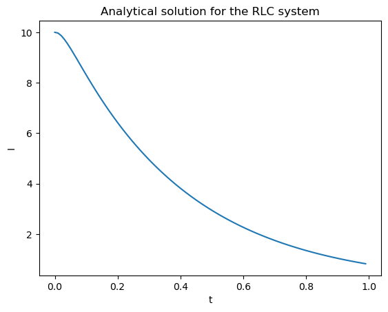
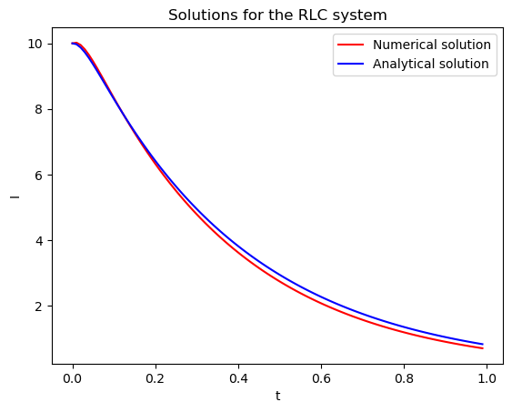

<script type="text/x-mathjax-config">
    MathJax.Hub.Config({
        tex2jax: {
        skipTags: ['script', 'noscript', 'style', 'textarea', 'pre'],
        inlineMath: [['$','$']]
        }
    });
    </script>
      
<script type="text/javascript" async src="https://cdn.mathjax.org/mathjax/latest/MathJax.js?config=TeX-MML-AM_CHTML"> </script>

# Differential Equation and Numerical Method

**Towards Dynamical Systems Modeling**

*Posted on: December 2023*

---

## Modelling and Differential equation


Research cannot be separated from modelling. Modelling is a mental process with the purpose to better understand what we perceived. There are many ways to model these perception. The simplest way but not easy to notice is language. Language can be used to model what we perceived. We saw that the sun for some reason rises from east days after days. Hence, it is rational if we said that next day, the sun will rises from the sun. We will never know if our model 100% correct. What we can do is to compare one model to another model and see which one is less right if we match with the data. There are many languages we can use. One of them in particular, stand out the most to model what we perceive for the last hundred of years. That language is mathematics.

What we perceived are called data. Data comes from process. There are many type of process. There is a process of variability. Most often, this type of process is being used to understand the residue of our model, things that can't be explained. One particular process that is interesting in engineering is a process that change continuously. We can see them in our everyday life. A car accelerating in a straight line and slow down in junction before the driver steer the wheel left. Or a gas in a tank heated up to seperate their molecules. Or a seasonal profit of a company from year to year. Not only process that change, we can also model a process that do not change. Before building a house, civil engineers model the house so that the change in every structure of the house equal zero.

In mathematics, there is a useful methods to model these kind of process. It is called differential equation. Consider an electrical circuit given by Figure 1. Many real world phenomenons can be modeled using electrical circuit. Not only to model electrical networks, it can also model neurons as its behavior resemble capacitors. The circuit in the figure in particular is called RLC circuit. The circuit has no source and at first the current is 0 and the capacitor voltage is 5 V.


Using Kirchhoff's law, the mathematical model is

$$L I^" + R I' + \frac{1}{C} I = 0$$

This is a homogeneous ordinary differensial equation (ODE).

## Ways to solve ODE analytically are many

Just like in our everday language such as english such as sentence structure, math also has somewhat the same thing as sentence structure called analytics. In analytics, we used our understanding and rule of the sentence to come up with the solution. There are many analytics method. Example of analytics methods. Depend on the form, many people discovered/invent ways to solve it.

There are many ways to solve differential equation analytically, what follows is just one way on solving this. To solve this, the general solution of is in the form of

$$I(t) = c_1 e^{\lambda_1 t} + c_2 e^{\lambda_2 t}$$

where $\lambda_1$ and $\lambda_2$ is the root of characteristic equation

$$L \lambda^2 + R \lambda + \frac{1}{C} = 0$$

If we subtitute $L = 1$, $R = 40$, and $C = 0.01$ we get the value for $\lambda_1$ and $\lambda_2$ as

$$\lambda_1 = -37.2, \lambda2 = -2.6$$

then the general solution is

$$I(t) = c_1 e^{-37.2 t} + c_2 e^{-2.6 t}$$

The particular solution, specifying the value for $c_1$ and $c_2$, is obtained by subtituting the initial condition to the solution. Differentiating the solution with respect to $t$ result in

$$I'(t) = -37.2 c_1 e^{-37.2 t} - 2.6 c_2 e^{-2.6 t}$$

Supposed the initial condition for the system is $I(t) = 10$ and $I'(t) = 2$. Subtituting this the both the solution and its differentiation result in

$$10 = c_1 + c_2$$

$$c_2 = 10 - c_1$$

and

$$2 = -37.2 c_1 - 2.6 c_2$$

$$2 = -37.2 c_1 - 2.6 (10 - c_1)$$

$$2 = -37.2 c_1 - 26 + 2.6 c_1$$

$$28 = -34.6 c_1$$

$$c_1 = -0.8$$

so for $c_2$

$$c_2 = 10 - c_1$$

$$c_2 = 10 + 0.8$$

$$c_2 = 10.8$$

The solution for the system is

$$I(t) = -0.8 e^{-37.2 t} + 10.8 e^{-2.6 t}$$

this solution can be plotted from $t = 0$ to $t = 1$


```python
import numpy as np
import matplotlib.pyplot as plt

t = np.arange(0, 1, 0.01)
I = -0.8*np.exp(-37.2 * t) + 10.8*np.exp(-2.6 * t)

plt.plot(t,I)
plt.title("Analytical solution for the RLC system")
plt.xlabel("t")
plt.ylabel("I")
```


    Text(0, 0.5, 'I')


    

    


As you can see, by modeling the process as mathematical model using calculus, we can study the process behavior.

## Numerical methods and why it used to solve ODE

Unfortunately, there are several differential equations that can not be solved analyticaly. The normal distribution model, for example, cannot be solved analytically.

In this case, what we can do is approximate the solution so the approximated solution be as close as possible to the true solution (which we never know). This method is called numerical methods. Of course because it is only an approximation, there will be disrepancy between the true solution and the approximated solution. The disrepancy is called error and it relate to the bias and variance of the estimator/methods. Same as analytical solution, there are many numerical methods we can use.

In our problem, we can replace the analytic solution with numerical solution using Runge-Kutta method as implemented below. Runge-Kutta returns a family of solution rather than specific solution, so there are types of Runge-Kutta methods. I think more on Runge-Kutta should be written on different journal. Nevertheless, the Runge-Kutta family that I am going to use is the fourth order Runge-Kutta. The fourth order Runge-Kutta approximate the next value based on

$$y_{i+1} = y_i + \frac{1}{6}(k_1 + 2k_2 + 2k_3 + k_4)h$$

where

$$k_1 = f(x_i, y_i)$$

$$k_2 = f(x_i + 0.5h, y_i + 0.5k_1h)$$

$$k_3 = f(x_i + 0.5h, y_i + 0.5k_2h)$$

$$k4 = f(x_i + h, y_i + k_3h)$$

In the case of second order ODE, we can transform the system into two first order ODE

$$z_1 = y$$

$$z_2 = y'  = z_1'$$

Our RLC system then becomes

$$z_2' = I'' = -\frac{R}{L} z_2 - \frac{1}{CL} z_1$$

$$z_1' = z_2$$


```python
h = 0.01

# space of solutions
z1 = np.zeros_like(t)
z2 = np.zeros_like(t)

# initial conditions
z1[0] = 10
z2[0] = 2

# differential equations
def derivatives(z1, z2):
  return [z2, (-40*z2)-(100*z1)]

# fourth order runge-kutta
for i, time in enumerate(t):
  if i+1 != len(t):
    ym11 = h*z1[i]
    ym12 = h*z2[i]
    k11, k12 = np.multiply(h, derivatives(z1[i], z2[i]))

    ym21 = h*(z1[i] + 0.5*k11)
    ym22 = h*(z2[i] + 0.5*k12)
    k21, k22 = np.multiply(h, derivatives(z1[i] + 0.5*ym11, z2[i] + 0.5*k11))

    ym31 = h*(z1[i] + 0.5*k21)
    ym32 = h*(z2[i] + 0.5*k22)
    k31, k32 = np.multiply(h, derivatives(z1[i] + 0.5*ym21, z2[i] + 0.5*k21))

    ym41 = h*(z1[i] + k31)
    ym42 = h*(z2[i] + k32)
    k41, k42 = np.multiply(h, derivatives(z1[i] + ym31, z2[i] + k31))

    z1[i+1] = z1[i] + (k11 + 2*k21 + 2*k31 + k41)/6
    z2[i+1] = z2[i] + (k21 + 2*k22 + 2*k32 + k42)/6
```


```python
plt.plot(t, z1, color='r', label="Numerical solution")
plt.plot(t, I, color='b', label='Analytical solution')
plt.legend()
plt.title("Solutions for the RLC system")
plt.xlabel("t")
plt.ylabel("I")
```


    Text(0, 0.5, 'I')


    

    


## After thought

What interesting is that these days, more and more numerical methods are being used to solve world problems. As discussed earlier, it will never be the solution because it is only an approximation. Though for most system in engineering the error could be disregard if it small enough, for other system such as chaotic system, in which the system is sensitive to initial condition, this error could be huge. Hence, more and more research and thought should be done in said field.

## Reference

- Erwin Kreyzig, Advanced Engineering Mathematics
- Steven Chapra and Raymond Canale, Numerical Methods for Engineers
